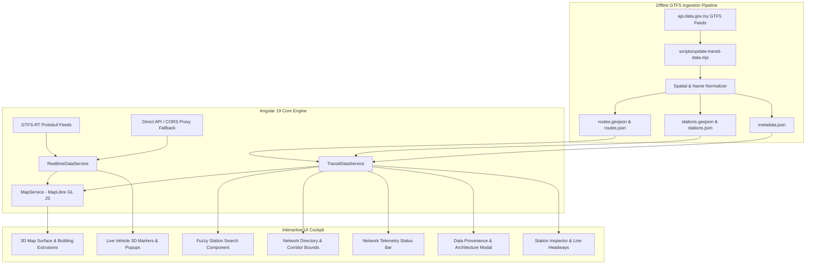

# MYTransit 3D — Malaysia Interactive Transit & Urban Digital Twin

> **A portfolio-grade Smart Transit Operations Center & Geospatial Digital Twin for the Klang Valley rail and bus network (Kuala Lumpur, Malaysia), powered by Angular 19, MapLibre GL JS, RxJS, and official open data from `data.gov.my`.**

[](https://angular.dev/)
[](https://www.typescriptlang.org/)
[](https://maplibre.org/)
[](LICENSE)
[](https://github.com/)

---

## Executive Summary

**MYTransit 3D** transforms raw General Transit Feed Specification (GTFS) data and real-time Protobuf telemetry from Malaysian transport authorities into an interactive, 3D urban operations command center. Rather than a conventional transit lookup app, MYTransit 3D functions as a **mission-critical dispatch and digital twin interface** for Greater Kuala Lumpur and the Klang Valley.

Built entirely as a static-deployable Single Page Application (SPA), the system operates with **zero server-side database dependencies**, handles real-time vehicle streams with automatic timetable fallback, renders thousands of 3D building extrusions in real time, and is optimized for deployment on GitHub Pages.

---

## Architecture Overview



---

## Key Capabilities & Features

### 1. 3D Geospatial Digital Twin
- **Dynamic 3D Extrusions**: Interpolates building render heights and min-heights from OpenMapTiles vector data, color-coded by elevation.
- **Atmospheric Perspective**: Pitch angles up to 62° with custom camera easing for dramatic station-level approaches.
- **Corridor Camera Fitting**: Automatically bounds, pads, and tilts the viewport when focusing on transit corridors (e.g. MRT Kajang Line vs. Monorail).
- **2D / 3D Orthographic Toggle**: One-click switch between tactical 2D schematic alignment and immersive 3D perspective.

### 2. GTFS Network & Platform Normalization
- **Intelligent Platform Clustering**: Raw GTFS feeds often treat northbound, southbound, and separate track platforms as distinct stops. MYTransit 3D clusters raw physical stops (227 raw platform stops) into **191 logical transit interchanges** using a 400m spatial radius and Levenshtein name distance.
- **Interconnecting Network Graph**: Identifies cross-modal connections (e.g., Pasar Seni connecting MRT Kajang and LRT Kelana Jaya; KL Sentral uniting KTM, LRT, Monorail, and MRT Muzium Negara).

### 3. Real-Time Tracking & Graceful Degradation (Rule 15 Adherence)
- **GTFS-RT Protobuf Parser**: Native browser-side decoding of binary Protocol Buffers (`gtfs-realtime-bindings`) for vehicle coordinates, bearings, and route identifiers.
- **Direct & Proxy Fallback**: Attempts direct fetch from `api.data.gov.my`; falls back to open CORS relay if blocked by browser security policies; cleanly switches to `SCHEDULED` status if feeds are unreachable.
- **Zero Fabrication Guarantee**: The system never fakes or fabricates realtime vehicle positions. When telemetry is unavailable, the UI transparently marks status as `SCHEDULED` with timetable-derived headways.

### 4. High-Performance Fuzzy Search & Deep Linking
- **Keyboard-First Telemetry**: Instant search with fuzzy matching, keyword scoring (e.g. searching "KL" or "118" matches KL Sentral and Merdeka 118).
- **Shortcuts**: Press `/` or `Ctrl+K` from anywhere to focus search; use `↑` and `↓` arrows to navigate; `Enter` to fly camera to the station; `Esc` to dismiss.
- **Hash-Based Deep Linking**: Shareable URL scheme (`#/station/:id`) compatible with all static hosts including GitHub Pages.

### 5. Multi-Mode Corridor Isolation
- Filter by transit mode: `ALL`, `MRT`, `LRT`, `MONORAIL`, `KTM`, or `BUS`.
- Active Corridor HUD with real-time station count and one-click corridor bounds reset.

### 6. Accessibility & Operations UX
- **WCAG 2.1 Compliant**: High-contrast `:focus-visible` keyboard rings, ARIA labels, and `prefers-reduced-motion` detection.
- **Mobile Adaptive**: Bottom docking controls, responsive drawer slide-overs, and a mobile backdrop dismissal layer.
- **Offline / Air-Gap Detection**: Automatic online/offline network listeners alert operators when running purely from client-side cached geometry.

---

## Supported Transit Lines & Corridors

| Line / Corridor | Line Code | Operator | Primary Color | Hex Code |
|:---|:---:|:---|:---:|:---:|
| **MRT Kajang Line** | `KG` | Rapid Rail (Prasarana) | Emerald Green | `#008751` |
| **MRT Putrajaya Line** | `PY` | Rapid Rail (Prasarana) | Solar Yellow | `#FFCD00` |
| **LRT Kelana Jaya Line** | `KJ` | Rapid Rail (Prasarana) | Crimson Red | `#E31837` |
| **LRT Ampang Line** | `AG` | Rapid Rail (Prasarana) | Vibrant Orange | `#F58220` |
| **LRT Sri Petaling Line** | `SP` | Rapid Rail (Prasarana) | Royal Maroon | `#6A2C91` |
| **KL Monorail Line** | `MR` | Rapid Rail (Prasarana) | Lime Green | `#8DC63F` |
| **KTM Komuter (Batu Caves – Tampin)** | `KC` | KTMB | Navy Blue | `#004B87` |
| **KTM Komuter (Tg Malim – Port Klang)** | `TP` | KTMB | Deep Magenta | `#C2185B` |
| **BRT Sunway Line** | `BRT` | Rapid Rail / Sunway | Forest Green | `#115740` |
| **Rapid Bus KL / MRT Feeder** | `B` | Rapid Bus | Bright Cyan | `#00BCD4` |

---

## Data Sources & Provenance

| Source Entity | Data Type | Official Endpoint | Update Cadence | License |
|:---|:---|:---|:---:|:---|
| **Government of Malaysia** | Static GTFS (Rail & Bus) | `api.data.gov.my/gtfs-static/*` | Weekly / Monthly | [OGL-MY 1.0](https://data.gov.my/terms-of-use) |
| **Government of Malaysia** | Realtime GTFS-RT (Protobuf) | `api.data.gov.my/gtfs-realtime/*` | ~15-30 seconds | [OGL-MY 1.0](https://data.gov.my/terms-of-use) |
| **Prasarana Malaysia Berhad** | Transit Timetables & Shapes | Via Open Data Initiative | Periodic | Malaysian Open Data |
| **Keretapi Tanah Melayu (KTMB)** | Commuter Routes & Stops | Via Open Data Initiative | Periodic | Malaysian Open Data |
| **OpenFreeMap / OpenMapTiles** | Vector Tiles & 3D Footprints | `tiles.openfreemap.org` | Continuous | [ODbL / CC-BY](https://openfreemap.org) |
| **OpenStreetMap Contributors** | Street & Highway Geometry | Via OpenMapTiles | Real-time | [ODbL](https://www.openstreetmap.org/copyright) |

---

## GTFS Data Ingestion Pipeline

The project ships with a self-contained Node.js processing pipeline in [`scripts/update-transit-data.mjs`](scripts/update-transit-data.mjs) that normalizes raw GTFS archives into high-performance GeoJSON assets:

```bash
npm run update-transit-data
```

### What the script executes:
1. **Pulls Official Archives**: Downloads static GTFS zip archives for Rapid Rail (Prasarana) and KTMB.
2. **Decompresses In-Memory**: Extracts `routes.txt`, `trips.txt`, `shapes.txt`, `stops.txt`, and `stop_times.txt` without writing intermediate zip files to disk.
3. **Reconstructs Line Geometries**: Assembles coordinates from `shapes.txt` into continuous GeoJSON `LineString` and `MultiLineString` features.
4. **Performs Spatial Clustering**: Groups stops sharing the same root name within 400 meters to create single logical multi-platform stations.
5. **Generates Static Deliverables**: Writes minified JSON and GeoJSON files to `public/assets/transit/` (`routes.geojson`, `stations.geojson`, `routes.json`, `stations.json`, `metadata.json`).

> **Note for CI/CD**: Pre-processed static assets are committed in the repository so `npm start` and `npm run build` run completely offline without requiring network downloads or API keys.

---

## Real-Time Engine & CORS Limitations

### Why Realtime Behaves Differently in Browsers
`api.data.gov.my` publishes GTFS-Realtime Protocol Buffer endpoints for vehicle positions. However, the server does not return `Access-Control-Allow-Origin: *` headers, which causes web browsers to block direct client-side requests under Cross-Origin Resource Sharing (CORS) policies.

### Our Multi-Tier Resilience Architecture
1. **Tier 1 (Direct Fetch)**: Attempts a direct HTTP GET with Protobuf ArrayBuffer response type.
2. **Tier 2 (Open CORS Relay)**: If Tier 1 fails due to CORS, seamlessly retries via a public CORS reverse proxy (`corsproxy.io`).
3. **Tier 3 (Timetable Fallback)**: If external feeds are blocked or offline, switches immediately to official scheduled timetable headways.
4. **Operator Visibility**: The status bar explicitly indicates whether the system is connected to `LIVE TELEMETRY` or displaying `SCHEDULED TIMETABLE` data.

---

## Local Development & Setup

### Prerequisites
- **Node.js**: `v20.x` or `v22.x` (LTS recommended)
- **npm**: `v10.x` or higher
- Modern web browser with WebGL 2.0 support (Chrome, Edge, Firefox, Safari)

### Installation

```bash
# 1. Clone the repository
git clone https://github.com/your-username/MYTransit-3D.git
cd MYTransit-3D

# 2. Install dependencies
npm install

# 3. Start local development server
npm start
```

Navigate to `http://localhost:4200/` in your browser.

### Production Build

```bash
# Standard production build (dist/my-transit-3d/browser)
npm run build

# GitHub Pages production build (relative base-href ./)
npm run build:gh-pages
```

### Running Unit Tests

```bash
# Execute headless unit test suite
npm test -- --watch=false
```

---

## Performance Optimizations

1. **ChangeDetectionStrategy.OnPush**: All components use Angular `OnPush` change detection and direct RxJS stream subscription via `async` pipes.
2. **MapLibre Layer Deduplication**: Layers are created once with dynamic data source updating (`source.setData(...)`) to eliminate WebGL buffer reallocation.
3. **Vector Tile Caching**: Base map vector tiles are served from globally distributed CDNs with local browser caching.
4. **Optimized Bundle Size**: Initial bundle is ~358 kB gzipped (including MapLibre GL engine, Protobuf decoder, and UI components).

---

## Keyboard Shortcuts

| Shortcut | Action |
|:---:|:---|
| `/` or `Ctrl+K` | Focus Search Station input |
| `↑` / `↓` | Navigate station search results |
| `Enter` | Select highlighted station and focus camera |
| `Esc` | Clear search results / Dismiss focus |

---

## License & Attribution

- **Source Code**: MIT License. Free for open-source, educational, and portfolio use.
- **Transit Data**: Copyright © 2026 Government of Malaysia. Open Government License - Malaysia (OGL-MY 1.0).
- **Basemap & Vector Tiles**: OpenFreeMap / MapLibre. Map data © [OpenStreetMap](https://www.openstreetmap.org/copyright) contributors.
